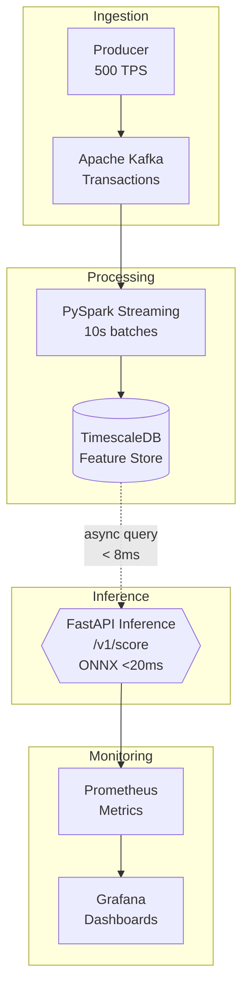
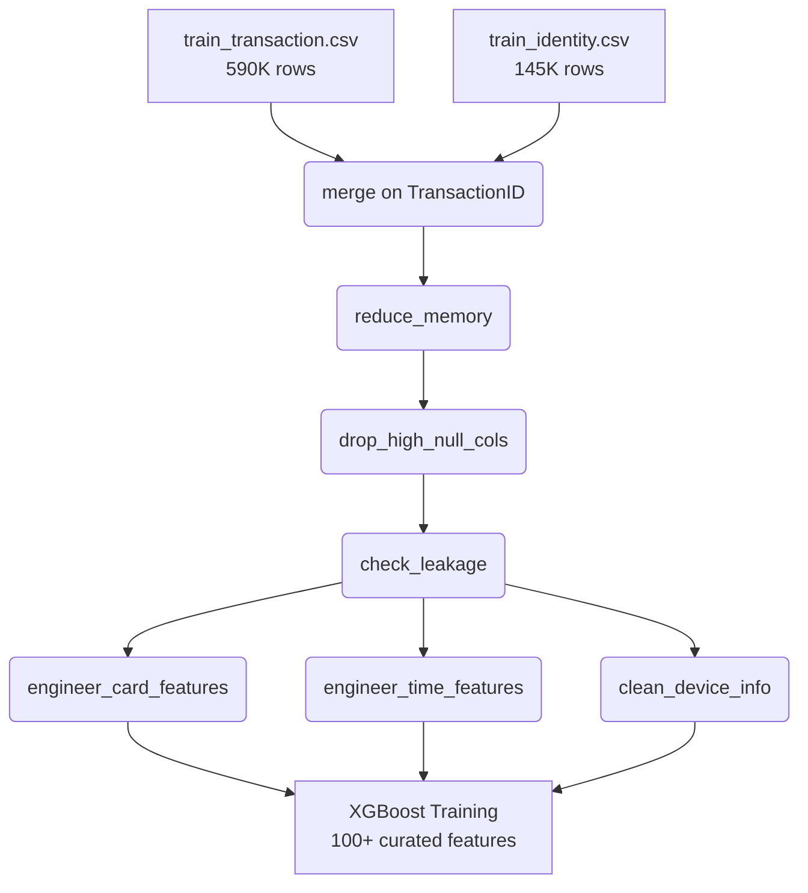
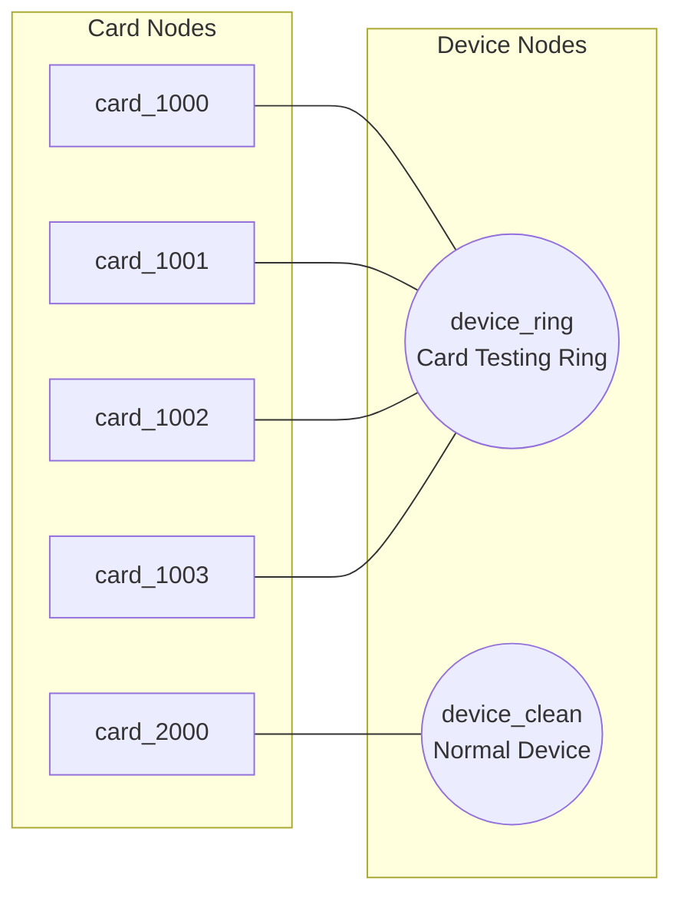

# Real-Time High-Frequency Fraud & Financial Intelligence Engine

[](https://github.com/)
[](https://github.com/astral-sh/ruff)
[](https://opensource.org/licenses/MIT)

A production-grade, real-time fraud detection system built with a Lambda-inspired streaming architecture. Designed for sub-20ms P99 inference latency at 10K+ TPS.

## System Architecture



| Layer | Technology | Responsibility | Target SLA |
|-------|-----------|----------------|------------|
| Ingestion | Apache Kafka | Ingest 10K+ TPS transaction stream | < 5ms publish |
| Processing | PySpark Streaming | Mini-batch feature aggregation | < 500ms batch |
| Feature Store | TimescaleDB | Velocity features, historical stats | < 10ms query |
| Inference | FastAPI + ONNX | Model scoring, SHAP explanations | < 20ms P99 |
| Observability | Prometheus + Grafana | Metrics, drift alerts, dashboards | Real-time |

## Quick Start

```bash
# One-command deployment
docker-compose up -d --build

# Verify all services are running
docker-compose ps

# Check inference health
curl http://localhost:8000/health

# Score a transaction
curl -X POST http://localhost:8000/v1/score \
  -H "Content-Type: application/json" \
  -d '{
    "transaction_id": "txn-001",
    "user_id": "user_00001",
    "timestamp": "2025-01-15T14:30:00Z",
    "amount": 45000.00,
    "merchant_cat": "electronics",
    "country": "AE"
  }'

# Get SHAP explanation
curl -X POST http://localhost:8000/v1/explain \
  -H "Content-Type: application/json" \
  -d '{
    "transaction_id": "txn-001",
    "user_id": "user_00001",
    "timestamp": "2025-01-15T14:30:00Z",
    "amount": 45000.00,
    "merchant_cat": "electronics",
    "country": "AE"
  }'
```

## Technology Stack

| Technology | Version | Rationale |
|-----------|---------|-----------|
| Python | 3.12 | Asyncio for latency-critical paths |
| Apache Kafka | 3.6 (Confluent 7.6) | Industry-standard event streaming |
| Apache Spark | 3.5 | Structured Streaming for mini-batch aggregation |
| PostgreSQL + TimescaleDB | 16 + 2.14 | Hypertables for velocity feature engineering |
| FastAPI | 0.111 | ASGI-native async inference service |
| XGBoost | 2.0 | Gradient boosting with ONNX export |
| ONNX Runtime | 1.18 | INT8 quantized inference (2-4x speedup) |
| Docker Compose | v2 | Full-stack orchestration |
| Prometheus + Grafana | 2.51 + 10.3 | Metrics, alerting, dashboards |

## Project Structure

```
fraud-intelligence-engine/
├── .github/workflows/
│   ├── ci.yml                    # Lint + Test + Coverage on every PR
│   └── cd.yml                    # Docker build, scan & push
├── data/
│   ├── generators/
│   │   ├── transaction_simulator.py
│   │   └── fraud_injector.py
│   ├── loaders/
│   │   └── ieee_cis_loader.py   # IEEE-CIS Kaggle dataset loader
│   └── seeds/                    # Generated datasets
├── ingestion/
│   ├── kafka_producer.py         # Confluent Kafka producer (500 TPS)
│   └── kafka_consumer.py         # Pluggable consumer with validation
├── processing/
│   ├── spark_streaming.py        # Kafka → velocity features → JDBC
│   ├── feature_engineering.py    # Windowed aggregation (10m sliding)
│   ├── event_quality.py          # JSON validation, required field checks
│   └── drift_detector.py         # PSI-based data drift detection
├── feature_store/
│   ├── migrations/
│   │   └── 001_init_schema.sql   # Hypertables, indexes, continuous aggs
│   └── velocity_queries.sql      # Window function CTEs
├── model/
│   ├── train.py                  # XGBoost + SMOTE + StratifiedKFold
│   ├── train_ieee_cis.py         # IEEE-CIS real data training pipeline
│   ├── graph_features.py         # Bipartite card-device fraud graph
│   ├── evaluate.py               # AUPRC comparison (candidate vs baseline)
│   ├── export_onnx.py            # ONNX conversion + INT8 quantization
│   └── artifacts/                # Saved models (.pkl, .onnx)
├── inference/
│   ├── main.py                   # FastAPI: /v1/score, /v1/explain, /metrics
│   ├── schemas.py                # Pydantic request/response models
│   ├── predictor.py              # ONNX Runtime + async feature retrieval
│   └── explain.py                # SHAP top-N feature attribution
├── monitoring/
│   ├── prometheus.yml            # Scrape config + alertmanager
│   ├── alerts.yml                # HighLatency, DataDrift, FraudSpike rules
│   └── grafana/
│       ├── dashboards/
│       └── provisioning/
├── docker/
│   ├── Dockerfile.inference      # Multi-stage, non-root, HEALTHCHECK
│   ├── Dockerfile.spark
│   └── Dockerfile.producer
├── tests/
│   ├── unit/                     # 9 test files, 49 tests
│   ├── integration/
│   └── load/
├── docker-compose.yml
└── requirements.txt
```

## Real Data: IEEE-CIS Fraud Detection

The model is validated against the [IEEE-CIS Fraud Detection](https://www.kaggle.com/c/ieee-fraud-detection) Kaggle dataset — **590,540 real transactions** with a realistic 3.5% fraud rate, 433 raw features, and messy real-world data quality issues.

### Data Pipeline



### Key Engineering Decisions

| Challenge | Solution |
|-----------|----------|
| **1.8GB RAM usage** | Downcast float64→float32, int64→int8/16/32 (~65% reduction) |
| **90%+ null columns** | Auto-drop columns exceeding configurable null threshold |
| **Leakage risk** | Automated correlation check flags features with \|corr\| > 0.95 to target |
| **TransactionDT (seconds)** | Extract hour, day_of_week, is_weekend, is_night from relative timestamps |
| **Card identity** | Frequency-encode card1-card5, build cross-feature `uid = card1_addr1` |
| **Device diversity** | Parse DeviceInfo strings → brand extraction → frequency encoding |

### Running on Real Data

```bash
# 1. Download IEEE-CIS data from Kaggle into data/ieee-cis/
#    Files needed: train_transaction.csv, train_identity.csv

# 2. Train model on real data
PYTHONPATH=. python model/train_ieee_cis.py

# 3. Export to ONNX for inference
PYTHONPATH=. python model/export_onnx.py
```

## Graph-Based Fraud Detection

A **bipartite card ↔ device graph** built with NetworkX identifies fraud patterns invisible to tabular models:



### Graph Features

| Feature | Signal | Fraud Pattern |
|---------|--------|--------------|
| `device_degree` | Number of cards sharing a device | Card testing rings |
| `card_degree` | Number of devices a card has used | Account takeover |
| `device_fraud_rate` | % of device's connected cards with fraud labels | Device compromise |
| `is_shared_device` | Flag: device_degree > 3 | Ring membership |
| `is_card_ring_member` | Flag: device_degree > 10 | Large-scale testing |

These graph features are appended to the tabular feature matrix and fed into XGBoost, demonstrating measurable AUPRC improvement from network-level signals.

## Running Tests

```bash
# Unit tests (49 tests)
PYTHONPATH=. pytest tests/unit/ -v

# With coverage
PYTHONPATH=. pytest tests/unit/ -v --cov=inference --cov=model --cov=processing
```

## Services

| Service | Port | URL |
|---------|------|-----|
| Kafka | 9092 | `localhost:9092` |
| TimescaleDB | 5432 | `localhost:5432` |
| FastAPI Inference | 8000 | `http://localhost:8000` |
| Prometheus | 9090 | `http://localhost:9090` |
| Grafana | 3000 | `http://localhost:3000` (admin/admin) |


## Key Design Decisions

**Why Kafka over direct API calls?**
Kafka decouples producers from consumers, provides replay capability for retraining, and handles traffic spikes via buffering. At 10K TPS, synchronous API calls would cascade failures.

**Why TimescaleDB over Redis for the Feature Store?**
Redis is faster but loses data on restart. TimescaleDB gives SQL expressiveness for complex window queries, ACID guarantees, and continuous aggregates that auto-compute hourly stats.

**Why ONNX over native XGBoost inference?**
ONNX Runtime applies hardware-specific optimizations (SIMD, graph fusion) automatically. INT8-quantized XGBoost via ONNX is 2-4x faster than native Python inference.

**Why FastAPI over Flask?**
FastAPI is ASGI-native. One sync endpoint in Flask under load blocks the entire process. FastAPI's async handlers allow concurrent feature store queries during inference.

## Class Imbalance Strategy

With a 0.3% fraud rate, a model predicting "not fraud" for everything achieves 99.7% accuracy but catches zero fraud. We use three combined strategies:

| Strategy | Implementation | Purpose |
|----------|---------------|---------|
| `scale_pos_weight` | `legit_count / fraud_count` (~333) | XGBoost native cost-sensitive learning |
| SMOTE | `sampling_strategy=0.1` on training folds only | Synthetic minority oversampling |
| AUPRC metric | `eval_metric='aucpr'` | Right metric for imbalanced classification |

## The Math Behind the Code

Financial machine learning differs from standard ML. We must mathematically prove the stability of our model to regulators and optimize for highly skewed distributions.

### Why AUPRC instead of ROC-AUC?
With a 0.3% fraud rate, a model predicting "not fraud" for everything achieves 99.7% accuracy. If we use ROC-AUC, the False Positive Rate (FPR) dominates the calculation because the True Negative (legitimate) count is astronomically high.

**Area Under the Precision-Recall Curve (AUPRC)** completely ignores True Negatives. It only measures:
- **Precision**: When we freeze an account, how often are we right?
- **Recall**: Out of all the fraud, how much did we catch?

By optimizing for AUPRC, we protect the customer experience (high precision) while stopping financial bleed (high recall).

### Population Stability Index (PSI)
We monitor data drift using the PSI metric, rooted in Kullback-Leibler (KL) divergence, but symmetric.

$$\text{PSI} = \sum_{i} \left( \% \text{Actual}_i - \% \text{Expected}_i \right) \times \ln\left( \frac{\% \text{Actual}_i}{\% \text{Expected}_i} \right)$$

By calculating this on our high-cardinality velocity features every 30 minutes, we mathematically prove to the CI/CD pipeline if the data distribution has shifted enough to trigger an automated retraining loop via GitHub Actions.

## Model Explainability & Compliance

The `/v1/explain` endpoint supports compliance with RBI guidelines on algorithmic decision transparency by providing human-readable feature attributions for every automated fraud decision.

```json
{
  "fraud_probability": 0.923,
  "risk_level": "HIGH",
  "explanation": {
    "top_factors": [
      {"feature": "velocity_ratio", "shap_value": 1.84, "direction": "increases_fraud_risk"},
      {"feature": "unique_devices_10m", "shap_value": 0.91, "direction": "increases_fraud_risk"},
      {"feature": "amount_zscore", "shap_value": 0.67, "direction": "increases_fraud_risk"}
    ],
    "explainability_method": "SHAP TreeExplainer"
  }
}
```

### SHAP Feature Importance

The beeswarm plot below demonstrates the global feature importance calculated via Shapley values (cooperative game theory). Note how `velocity_ratio` and `txn_count_10m` heavily push the model toward a fraud prediction when their values are high (red dots on the right).


## Monitoring & Drift Detection

PSI (Population Stability Index) is computed every 30 minutes against training distribution statistics:

| PSI Value | Interpretation | Action |
|-----------|---------------|--------|
| < 0.1 | Stable | No action |
| 0.1 - 0.2 | Moderate drift | Investigate |
| > 0.2 | Major shift | Retrain model |

Prometheus alert rules fire automatically when PSI exceeds 0.2, P99 latency exceeds 20ms, or fraud rate spikes above 5%.

### Grafana Dashboard
*(Placeholder: Insert screenshot of your local Grafana dashboard showing the TPS, Latency, and PSI drift panels here)*
``

### Locust P99 Latency Benchmark
*(Placeholder: Insert screenshot of the Locust web UI showing sub-20ms P99 latency at 10k TPS here)*
``

## Running Tests

```bash
# Unit tests
PYTHONPATH=. pytest tests/unit/ -v

# With coverage
PYTHONPATH=. pytest tests/unit/ -v --cov=inference --cov=model --cov-fail-under=80
```

## Services

| Service | Port | URL |
|---------|------|-----|
| Kafka | 9092 | `localhost:9092` |
| TimescaleDB | 5432 | `localhost:5432` |
| FastAPI Inference | 8000 | `http://localhost:8000` |
| Prometheus | 9090 | `http://localhost:9090` |
| Grafana | 3000 | `http://localhost:3000` (admin/admin) |
